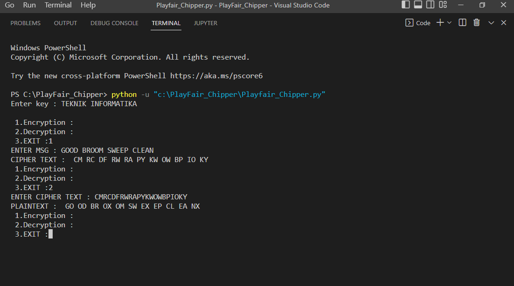
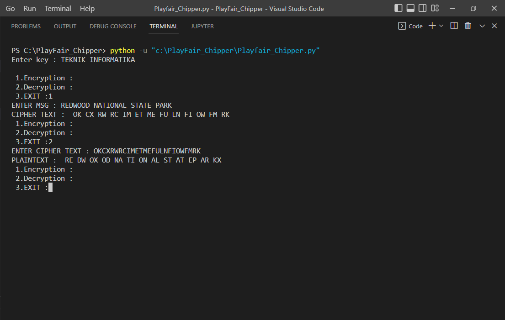
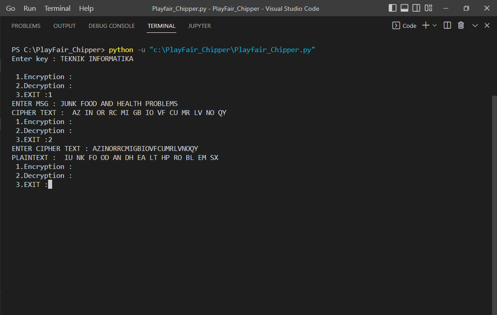

# PERTEMUAN 6 

| Nama : HERLIYANSYAH   | NIM : 312010387       |
|-----------------------|-----------------------|
| Kelas : TI.20.A.2     | KRIPTOGRAFI           |

## Lakukan Enkripsi Playfair Chiper dengan kalimat beriku

```
'GOOD BROOM SWEEP CLEAN'

 'REDWOOD NATIONAL STATE PARK'

 'JUNK FOOD AND HEALTH PROBLEMS'

```

Dan menggunakan kunci "TEKNIK INFORMATIKA"

Jawab:

Untuk dapat menghasilkan hasil outputnya, silahkan masukan kata kuncinya terlebih dahulu pada kolom 'Enter key'. Karena ditugas ini sudah diberikan kunci berupa 'TEKNIK INFORMATIKA' , maka disini saya memasukan kalimat tersebut pada bagian key.

Berikut hasil dari Encryption dan Decryption nya :

``` 
GOOD BROOM SWEEP CLEAN 

```



```
REDWOOD NATIONAL STATE PARK

```




```
JUNK FOOD AND HEALTH PROBLEMS

```



## TERIMA KASIH


